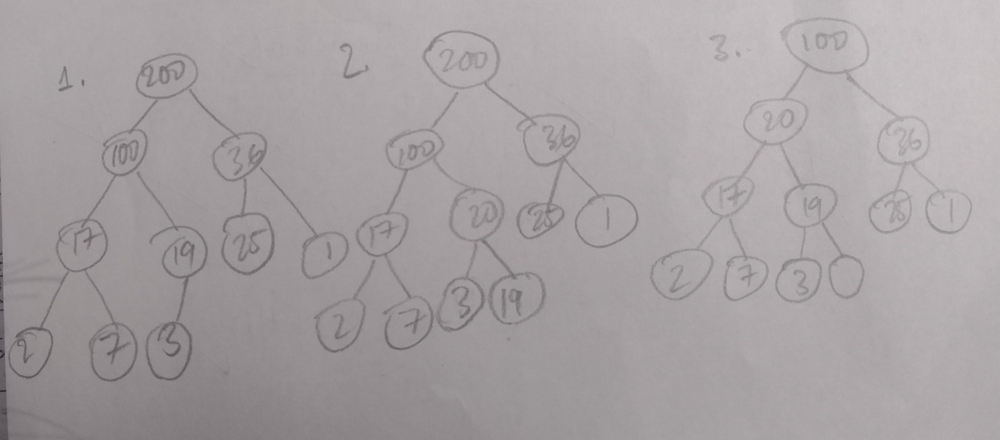

Exercise 1:
1. Add an empty node to the left-most of the lowest element on the left that is not the last level (in this case, add a left node to 3). Add the new element to that node, then heapify by comparing with parent node. If the child node is greater than the parent node, switch the two until the new element is in the correct position.
2. Add an empty node to the left-most of the lowest element on the left that is not the last level (in this case, add a right node to 19 which used to be 3 before heapifying in the previous step). Add the new element to that node, then heapify by comparing with parent node. If the child node is greater than the parent node, switch the two until the new element is in the correct position.
3. O(log(n)) because the number of elements to shift as we go up the tree decreases by half at each level

Exercise 2:
1. Switch 200 with the lowest, right-most node, then remove that node. The lowest, right-most node is now empty. Now, heapify the root node (where 200 originally was) by comparing with child nodes. If the parent node is less than the child node, switch the two until that node is in the correct position.
2. The lowest, right-most node.
3. See image below.
4. Repeat the operation in #1 with the new root node.
5. O(log(n))

